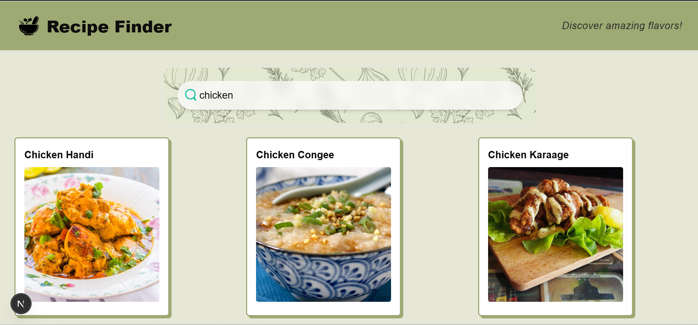
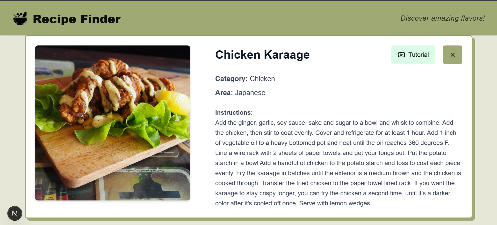

# 🥘 Recipe Finder

**Recipe Finder** is a web application built with **Next.js**, **TypeScript**, and **TailwindCSS** that allows users to search and explore recipes in real time using TheMealDB API.

## 🚀 Features

- 🔍 Real-time recipe search
- 🧾 Detailed recipe cards with ingredients and instructions
- 📺 YouTube tutorial links (if available)
- ♾️ Infinite scrolling for better user experience
- ⚡ Optimized and responsive UI
- ✅ Code quality tools: ESLint, Prettier, cSpell
- 🌐 SEO-ready with dynamic metadata

## 🛠️ Tech Stack

- [Next.js](https://nextjs.org/) with App Router
- [TypeScript](https://www.typescriptlang.org/)
- [TailwindCSS](https://tailwindcss.com/)
- [TheMealDB API](https://www.themealdb.com/)
- [Lucide React](https://lucide.dev/) for icons
- ESLint + Prettier + cSpell for code quality

## 📦 Installation

```bash
# Clone the repository
git clone https://github.com/yourusername/recipe-finder.git

# Navigate into the project
cd recipe-finder

# Install dependencies
npm install
```

## 💻 Running the App Locally

```bash
npm run dev
```

Visit [http://localhost:3000](http://localhost:3000)

## 🧪 Code Quality

```bash
npx eslint . --fix
npx prettier --write .
```

## 📦 Build for Production

```bash
npm run build
npm start
```

## ☁️ Deployment

You can easily deploy this app using [Vercel](https://vercel.com):

1. Push your project to GitHub.
2. Log into Vercel and import the repository.
3. Click "Deploy".

## 📸 Screenshots





---

Made with ❤️ by Jazmín Gamboa
